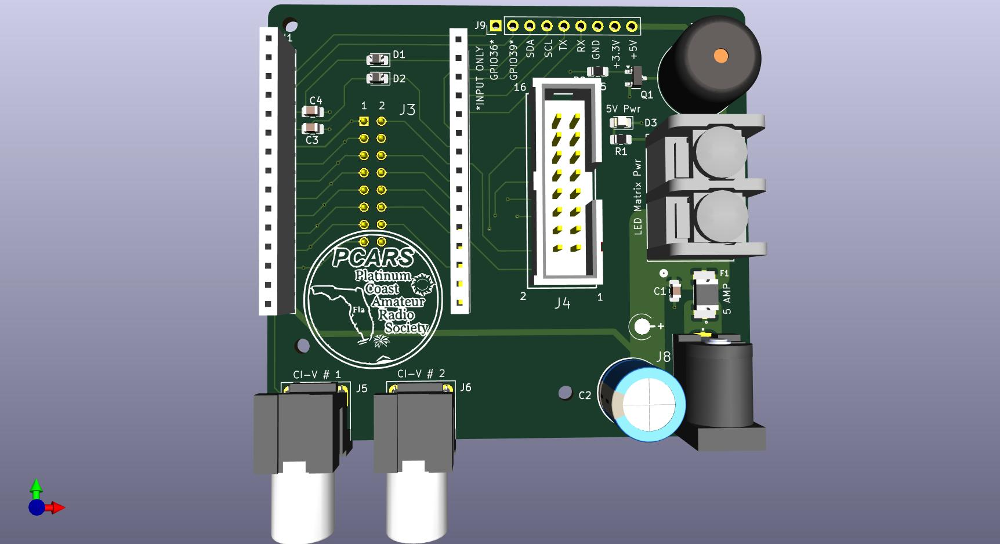
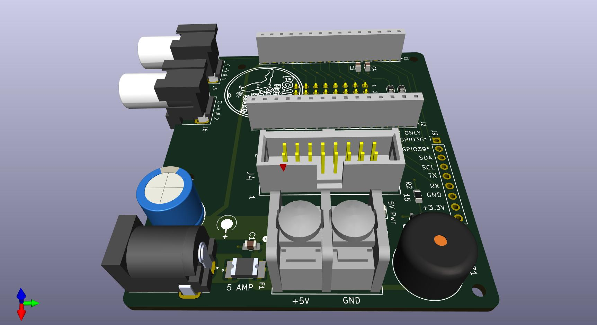
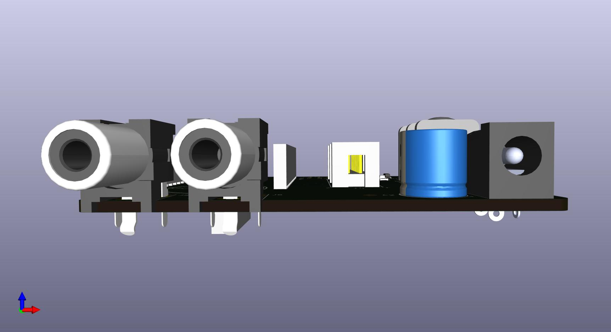
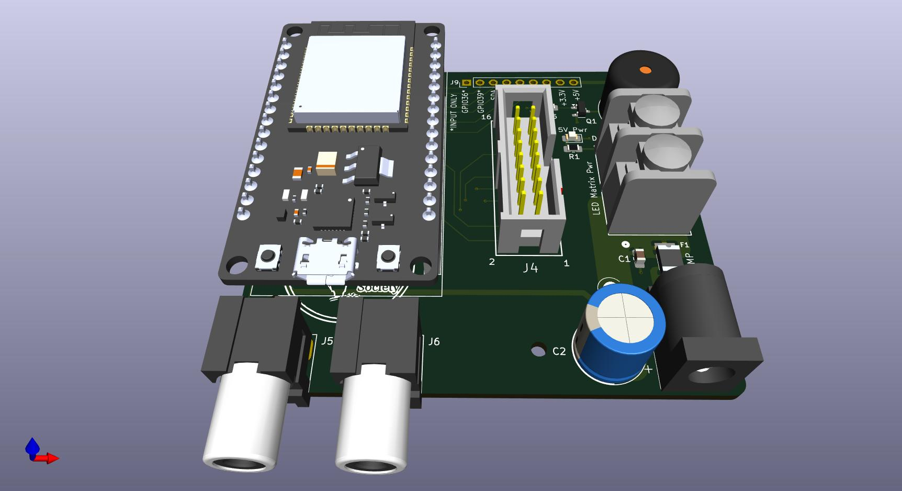
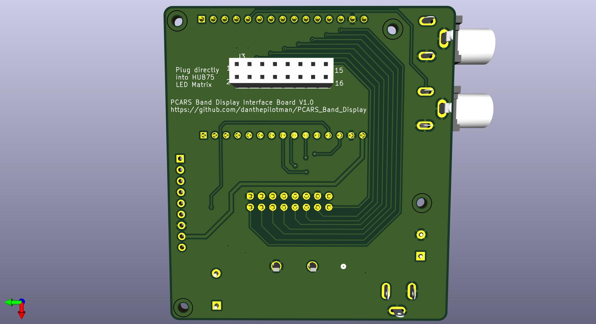

This folder contains PCB design files for the PCARS Band Display interface/controller board.

This booard is designed to plug directly into the ribbon cable connector on the back side of a HUB75 LED Matrix.

It is small enough to fit inside the cavity behind the LED Matrix.

The board provide interfaces for CI-V buses from 2 different radios.

The board also has connections for a DC power supply to power the LED Matrix and ESP32 controller.

A passive buzzder is also included to allow for alerting when both radios are tuned to the same band.

The PCB was designed using the KiCAD design suite.

The Library folder contains sub-folders for the individual part's Symbols, Footprints and 3D models.

The parts library files were download primarily from the SnapEDA website.

### Images:

### Bill of Materials:

[Bill of Materials](https://htmlpreview.github.io/?https://github.com/PCARS/PCARS_Band_Display/blob/master/hardware/V1/bom/ibom.html)
